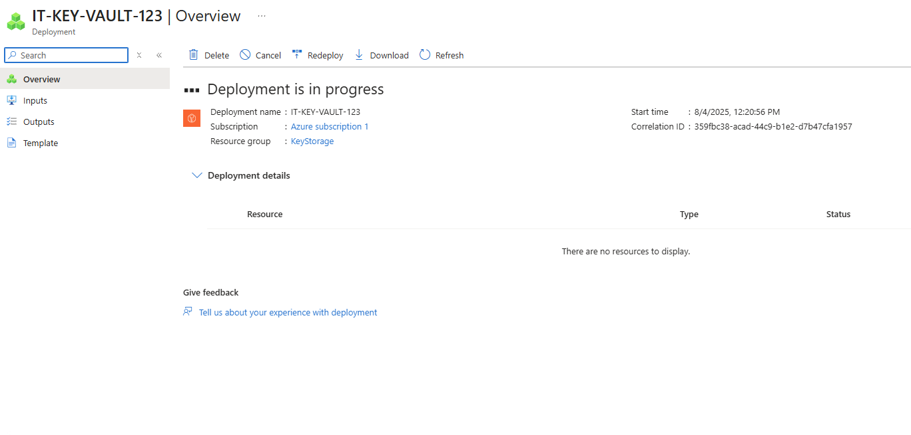
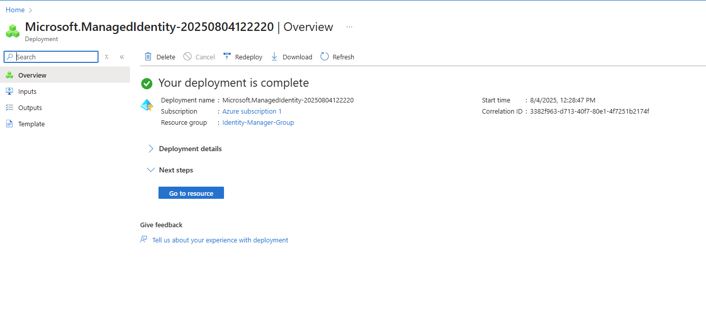
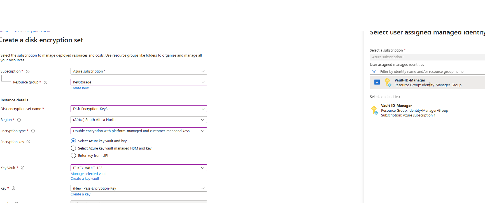

# Azure-Lab-Disk-Encryption-with-Customer-Managed-Keys-CMK-
This repo documents my Azure lab where I set up Disk Encryption Sets (DES) using Customer-Managed Keys (CMK) in Azure Key Vault.  I went through the process of deploying a Key Vault, creating a managed identity, fixing IAM permissions, and finally applying CMK encryption to a VM disk.

🔹 Step 1: Key Vault Deployment

Deployed IT-KEY-VAULT-123 inside the KeyStorage resource group.

Initially, no keys or access policies were configured.

📸 Screenshot:

🔹 Step 2: Managed Identity Deployment

Deployed a User-Assigned Managed Identity Vault-ID-Manager in the Identity-Manager-Group.

This identity is later used by the Disk Encryption Set to access the Key Vault.

📸 Screenshot:

🔹 Step 3: Disk Encryption Set (DES) Creation Attempt

Tried creating Disk-Encryption-KeySet with:

Double encryption (platform-managed + customer-managed keys).

Linked to Key Vault IT-KEY-VAULT-123 with key Pass-Encryption-Key.

Configured to use Vault-ID-Manager for access.

📸 Screenshot:

🔹 Step 4: Deployment Failure ❌

Error:
"Unable to access key vault resource … Please grant get, wrap, and unwrap key permissions to user-assigned identity 'Vault-ID-Manager'."

Cause: The managed identity had no Key Vault permissions yet.

📸 Screenshot:

🔹 Step 5: Fix – Adding Role Assignment ✅

Went into Key Vault IAM → Assigned:

Vault-ID-Manager → Key Vault Crypto User.

Myself → Key Vault Data Access Administrator.

📸 Screenshot:

🔹 Step 6: Disk Encryption Set Deployment (Retry) ✅

Deployment succeeded after fixing IAM permissions.

DES now correctly linked to the Key Vault.

📸 Screenshot:

🔹 Step 7: VM Disk Encryption Configuration

Applied DES to VM disk IT-VM-1_OsDisk.

Disk now shows:

Customer-managed key: Pass-Encryption-Key (from IT-KEY-VAULT-123).

Encryption set: Disk-Encryption-KeySet.

📸 Screenshot:

✅ End Result

Successfully set up Customer-Managed Keys (CMK) with Disk Encryption Sets in Azure:

Key Vault → Holds the encryption key.

Managed Identity → Grants access to the Key Vault.

Disk Encryption Set (DES) → Links VM disk to the Key Vault key.

VM Disk → Is now encrypted with both platform-managed keys and your own CMK.

⚡ The initial failure was due to missing IAM permissions. Once you granted the Key Vault Crypto User role to the managed identity, the deployment succeeded.

